# zhengqianbao-server
挣钱宝 go后端源码，使用Iris实现，blotdb数据库支持

## Quick Start

安装依赖

```
go get -u github.com/kataras/iris
go get -u github.com/iris-contrib/middleware/jwt
go get -u github.com/dgrijalva/jwt-go
go get -u github.com/boltdb/bolt
```

运行

```
go run main.go
```

## 使用说明

后台代码目前已经挂在到腾讯云服务器上，下面使用postman为例说明相关接口的使用

### 1. 注册功能

格式：

* post请求
* 接口地址：https://littlefish33.cn:8080/user/register
* 需提供表单字段：phone, iscow（0或1）, name, password, gender, age(必须为数字), university, company, description, class

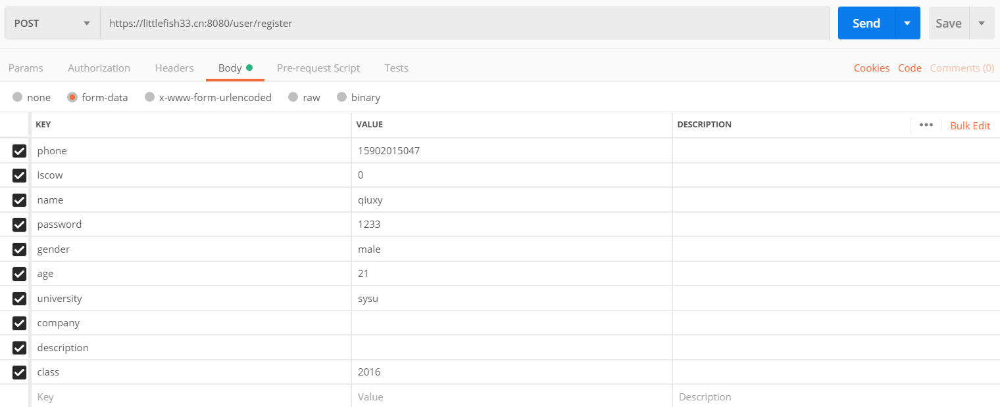

返回结果：

* 成功

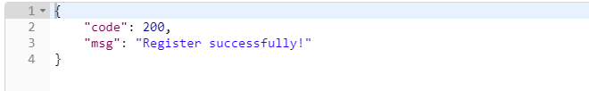

* phone为唯一的用户标识，所以phone已经存在会报错

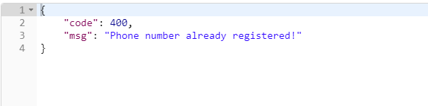


注意：除了phone必须在数据库中唯一外，表单字段的检查后端并没有提供，比如说age必须为`int`，奶牛不用填`university`等字段，`phone`不能为空等，因此这些需要在前端代码中先检测在提交

### 2. 登录功能

注册成功之后，就可以用注册的账号进行登录

格式：

- post请求
- 接口地址：https://littlefish33.cn:8080/user/login
- 需提供表单字段：phone，password

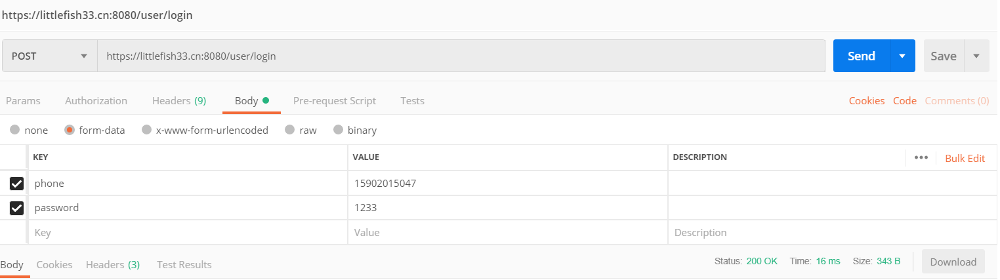

返回结果：

- 成功：登录成功后会返回一个token，以后用户发送请求的时候需要携带该token来告诉服务端用户当前处于登录状态，该token的有效期是2个小时，超过两个小时需要重新登录

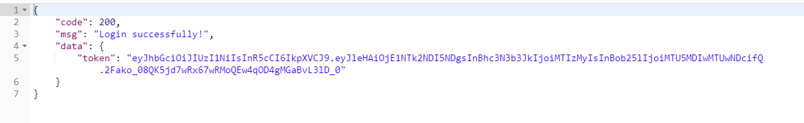

* 失败：用户不存在

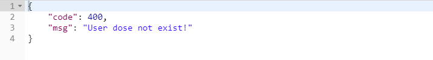

* 失败：密码错误

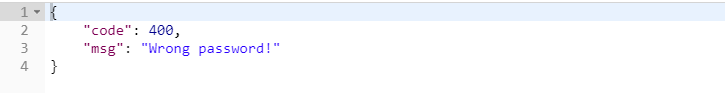

### 3. 注销功能

接口：

* Get请求
* 地址：https://littlefish33.cn:8080/user/logout

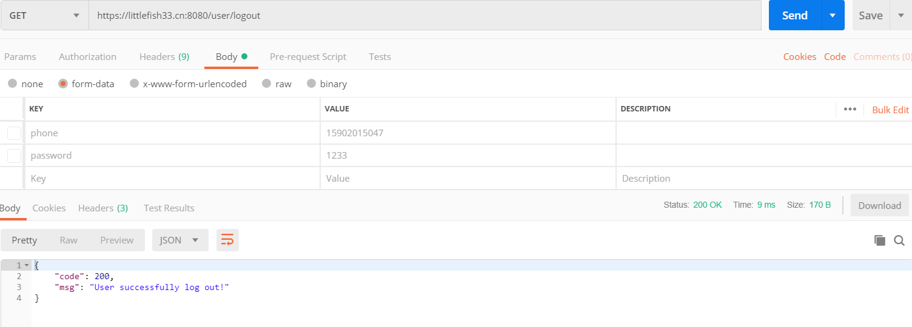

### 4. 查看用户信息

接口：

* Get请求
* 地址：https://littlefish33.cn:8080/user/profile

* 需要加入token（虽然我不知道你们react怎么加）

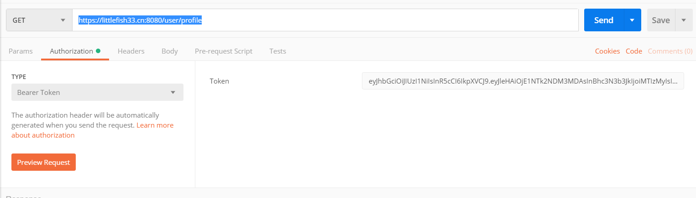

返回结果：

* 成功：这个之前忘改了，应该写成和之前一样返回一个状态码然后把用户信息放在data里的，不过就这样随便了吧

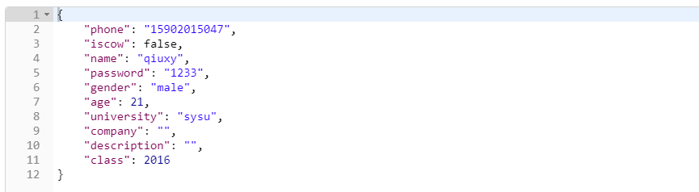

* 失败：错误的token

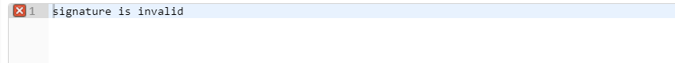

* 失败：超时

```json
{
    "code" : 400,
    "Msg" : "Time expend!"
}
```

### 5. 更新用户信息

接口：

* Post请求
* 地址：https://littlefish33.cn:8080/user/update
* 需要表单字段：和注册一样，但要注意phone不能更改

* token

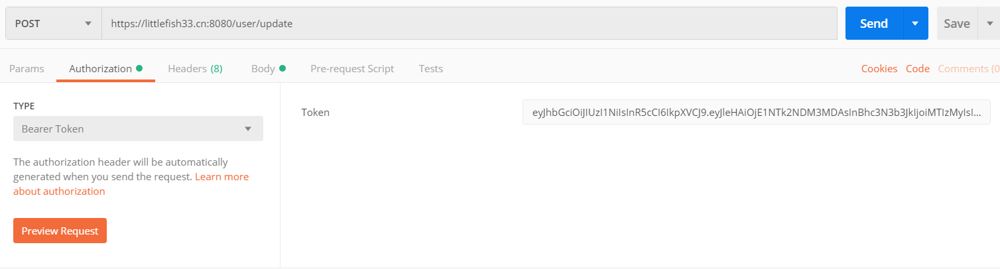


返回结果：

* 成功：

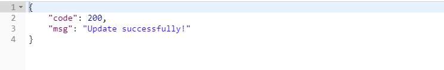

* 失败：phone前后不一致

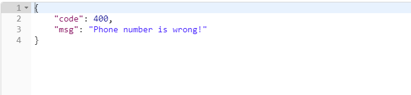

* 失败：token错误（和前面的是一样的，就不重新截图了）